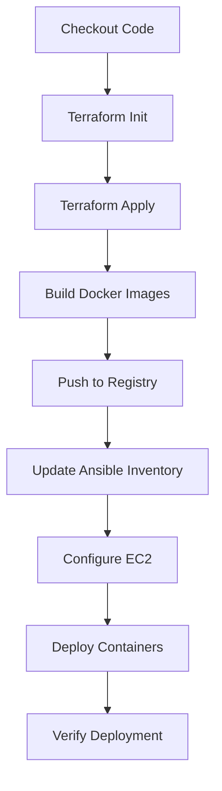

# 🚀 TaskFlow Jenkins Pipeline - Quick Reference

## 📌 Pipeline Overview

```
┌─────────────────────────────────────────────────────────────┐
│                    JENKINS CI/CD PIPELINE                   │
├─────────────────────────────────────────────────────────────┤
│  1. Checkout Code       │ Pull from Git repository          │
│  2. Terraform Init      │ Initialize infrastructure         │
│  3. Terraform Apply     │ Provision EC2 t3.micro           │
│  4. Build Docker Images │ Backend + Frontend (multi-stage)  │
│  5. Push to Registry    │ Docker Hub / ECR                  │
│  6. Update Inventory    │ Configure Ansible hosts.ini       │
│  7. Run Ansible         │ Install Docker, Nginx, deploy app │
│  8. Verify Deployment   │ Health checks                     │
└─────────────────────────────────────────────────────────────┘
```

## 🔑 Required Credentials (Jenkins)

| ID | Type | Usage |
|----|------|-------|
| `dockerhub-credentials` | Username/Password | Push Docker images |
| `aws-credentials` | AWS Credentials | Terraform AWS access |
| `ec2-ssh-key` | SSH Private Key | Ansible EC2 access |

## 📝 Configuration Checklist

- [ ] Update `DOCKER_HUB_REPO` in Jenkinsfile
- [ ] Update S3 bucket name in main.tf (must be unique)
- [ ] Generate SSH key pair: `ssh-keygen -t rsa -b 4096 -f taskflow-key`
- [ ] Add public key to project root: `taskflow-key.pub`
- [ ] Add private key to Jenkins credentials
- [ ] Configure AWS credentials in Jenkins
- [ ] Configure Docker Hub credentials in Jenkins

## 🎮 Pipeline Parameters

**ACTION:** 
- `deploy` - Deploy infrastructure and application
- `destroy` - Tear down all resources

**SKIP_TERRAFORM:**
- `false` - Run full Terraform provisioning
- `true` - Skip Terraform (use existing infrastructure)

## 💻 Common Commands

### Manual Deployment (No Jenkins)
```bash
# 1. Provision infrastructure
terraform init
terraform apply -auto-approve

# 2. Build images
docker build -t username/taskflow-backend:latest -f backend/Dockerfile.prod ./backend
docker build -t username/taskflow-frontend:latest -f frontend/Dockerfile.prod ./frontend

# 3. Push images
docker push username/taskflow-backend:latest
docker push username/taskflow-frontend:latest

# 4. Get EC2 IP
export EC2_IP=$(terraform output -raw backend_public_ip)

# 5. Update Ansible inventory
cat > hosts.ini << EOF
[ec2_instances]
taskflow ansible_host=${EC2_IP} ansible_user=ubuntu ansible_ssh_private_key_file=./taskflow-key
EOF

# 6. Deploy with Ansible
ansible-playbook -i hosts.ini deploy.yml
```

### Access Application
```bash
# Get URLs
terraform output application_urls

# SSH to EC2
ssh -i taskflow-key ubuntu@$(terraform output -raw backend_public_ip)

# Check containers
docker ps
docker logs taskflow-backend
docker logs taskflow-frontend
```

### Cleanup
```bash
# Destroy infrastructure
terraform destroy -auto-approve

# Or use Jenkins pipeline with ACTION=destroy
```

## 🐛 Troubleshooting

### Issue: Terraform state locked
```bash
terraform force-unlock <LOCK_ID>
```

### Issue: Can't connect to EC2
```bash
# Wait 60 seconds after creation
# Check security group allows port 22
# Verify SSH key permissions
chmod 600 taskflow-key
```

### Issue: Docker build failed
```bash
# Clear Docker cache
docker system prune -a
docker build --no-cache ...
```

### Issue: Ansible connection failed
```bash
# Test SSH
ssh -i taskflow-key ubuntu@<EC2-IP>

# Check Ansible inventory
cat hosts.ini

# Run with verbose
ansible-playbook -vvv -i hosts.ini deploy.yml
```

## 📊 Application URLs (After Deployment)

```
Frontend (React):  http://<EC2-IP>:3000
Backend (Node):    http://<EC2-IP>:5000
Health Check:      http://<EC2-IP>:5000/health
Nginx Proxy:       http://<EC2-IP>
S3 Static Site:    http://<bucket>.s3-website-us-east-1.amazonaws.com
```

## 🔒 Security Checklist

- [ ] Change default JWT_SECRET
- [ ] Use IAM roles instead of access keys
- [ ] Enable SSL/TLS in production
- [ ] Rotate SSH keys every 90 days
- [ ] Enable CloudWatch monitoring
- [ ] Set up automated backups
- [ ] Implement rate limiting
- [ ] Use secrets management (Vault/AWS Secrets Manager)

## 📚 File Reference

| File | Purpose |
|------|---------|
| `Jenkinsfile` | Pipeline definition |
| `main.tf` | Terraform infrastructure |
| `deploy.yml` | Ansible playbook |
| `hosts.ini` | Ansible inventory (auto-generated) |
| `docker-compose.prod.yml` | Production compose file |
| `backend/Dockerfile.prod` | Optimized backend image |
| `frontend/Dockerfile.prod` | Optimized frontend image |
| `JENKINS_SETUP.md` | Detailed setup guide |
| `DEPLOYMENT_GUIDE.md` | Complete deployment docs |

## 🎯 Jenkins Pipeline Stages



## ⚡ Quick Deploy

```bash
# One-liner to deploy everything
git clone <repo> && cd <repo> && \
ssh-keygen -t rsa -f taskflow-key -N "" && \
terraform init && terraform apply -auto-approve && \
docker build -t user/taskflow-backend -f backend/Dockerfile.prod backend && \
docker build -t user/taskflow-frontend -f frontend/Dockerfile.prod frontend && \
docker push user/taskflow-backend && docker push user/taskflow-frontend && \
export EC2_IP=$(terraform output -raw backend_public_ip) && \
echo "[ec2_instances]
taskflow ansible_host=${EC2_IP} ansible_user=ubuntu ansible_ssh_private_key_file=./taskflow-key" > hosts.ini && \
sleep 60 && ansible-playbook -i hosts.ini deploy.yml
```

## 📞 Support

- Full Setup Guide: `JENKINS_SETUP.md`
- Deployment Guide: `DEPLOYMENT_GUIDE.md`
- Environment Template: `.env.example`

---

**Last Updated:** January 2026
**Pipeline Version:** 1.0
